# Overview

> **Repository:** [github.com/NVIDIA/TensorRT-Edge-LLM](https://github.com/NVIDIA/TensorRT-Edge-LLM)

> For the NVIDIA DRIVE platform, please refer to the documentation shipped with the DriveOS release 

## What is TensorRT Edge-LLM?

TensorRT Edge-LLM is NVIDIA's high-performance C++ inference runtime for Large Language Models (LLMs) and Vision-Language Models (VLMs) on embedded platforms. It enables efficient deployment of state-of-the-art language models on resource-constrained devices such as NVIDIA Jetson and NVIDIA DRIVE platforms.

## Key Features

- **🚀 High Performance**: Optimized CUDA kernels and TensorRT integration for maximum throughput
- **💾 Memory Efficient**: Advanced KV cache management and quantization support (FP8, INT4)
- **🔄 Production Ready**: C++-only runtime with no Python dependencies
- **🎯 Edge Optimized**: Designed specifically for embedded and automotive platforms
- **🔧 Flexible**: Support for LoRA adapters, speculative decoding, and multimodal models
- **📊 Complete Toolkit**: Python export pipeline, engine builder, and runtime in one package

## Key Components

> **Code Location:** `tensorrt_edgellm/` (Python), `cpp/` (C++), `examples/` (Examples)

TensorRT Edge-LLM uses a three-stage pipeline:

```mermaid
%%{init: {'theme':'neutral', 'themeVariables': {'primaryColor':'#76B900','primaryTextColor':'#fff','primaryBorderColor':'#5a8f00','lineColor':'#666','edgeLabelBackground':'#ffffff','labelTextColor':'#000','clusterBkg':'#ffffff','clusterBorder':'#999'}}}%%

graph LR
    HF_MODEL[Autoregressive Models<br>*such as HuggingFace*]
    PYTHON_EXPORT(Python Export Pipeline)
    ONNX_MODEL[ONNX<br>Model]
    ENGINE_BUILDER(Engine Builder)
    TRT_ENGINE[TensorRT<br>Engines]
    CPP_RUNTIME(C++ Runtime)
    SAMPLES(Examples)
    APPLICATIONS(Applications)

    HF_MODEL --> PYTHON_EXPORT
    PYTHON_EXPORT --> ONNX_MODEL
    ONNX_MODEL --> ENGINE_BUILDER
    ENGINE_BUILDER --> TRT_ENGINE
    TRT_ENGINE --> CPP_RUNTIME
    CPP_RUNTIME --> SAMPLES
    SAMPLES --> APPLICATIONS

    classDef greyNode fill:#f5f5f5,stroke:#999,stroke-width:1px,color:#333
    classDef nvNode fill:#76B900,stroke:#5a8f00,stroke-width:1px,color:#fff
    classDef darkNode fill:#ffffff,stroke:#999,stroke-width:1px,color:#333
    classDef inputNode fill:#f5f5f5,stroke:#999,stroke-width:1px,color:#333
    classDef itemNode fill:#ffffff,stroke:#999,stroke-width:1px,color:#333

    class HF_MODEL inputNode
    class ONNX_MODEL,TRT_ENGINE itemNode
    class PYTHON_EXPORT,ENGINE_BUILDER,CPP_RUNTIME nvNode
    class APPLICATIONS darkNode
    class SAMPLES nvNode
```

| Component | Description |
|-----------|-------------|
| **Python Export Pipeline** | Python-based toolchain that converts HuggingFace models into ONNX format with quantization (FP8, INT4, NVFP4). [Learn More](03.1_Python_Export_Pipeline.md) |
| **Engine Builder** | C++-based application that compiles ONNX models into optimized TensorRT engines. [Learn More](03.2_Engine_Builder.md) |
| **C++ Runtime** | C++-based runtime that executes TensorRT engines with CUDA graphs, LoRA, and EAGLE support. [Learn More](04.1_C++_Runtime_Overview.md) |
| **Examples** | Reference implementations demonstrating LLM, multimodal, and utility use cases. [Learn More](05_Examples.md) |

## Use Cases

TensorRT Edge-LLM is ideal for:

**🚗 Automotive**
- In-vehicle AI assistants
- Voice-controlled interfaces
- Scene understanding and description
- Driver assistance systems

**🤖 Robotics**
- Natural language interaction
- Task planning and reasoning
- Visual question answering
- Human-robot collaboration

---

## Supported Platforms

### Hardware Platforms

| Platform | Software Release | Link |
|----------|------------------|------|
| NVIDIA Jetson Thor | JetPack 7.1 | [JetPack Website](https://developer.nvidia.com/embedded/jetpack) |
| NVIDIA DRIVE Thor | NVIDIA DriveOS 7 | For details refer to NVIDIA DriveOS 7 release documentation |

> **Note:** The platforms listed above are officially supported and tested. While TensorRT Edge-LLM may run on other NVIDIA GPU platforms (for example, discrete GPUs, other Jetson devices), these are not officially supported but may be used for experimental purposes.

### Supported Model Families

**Large Language Models:**
- Llama 3.x (1B - 8B)
- Qwen 2/2.5/3 (0.5B - 7B)
- DeepSeek-R1 Distilled (1.5B, 7B)

**Vision-Language Models:**
- Qwen2/2.5/3-VL (2B - 8B)
- InternVL3 (1B, 2B)
- Phi-4-Multimodal (Phi-4-multimodal-instruct, 5.6B)

Refer to [Supported Models](02_Supported_Models.md) for a complete list.

---

## Next Steps

1. **[Quick Start Guide](01.2_Quick_Start_Guide.md)**: Get up and running in 15 minutes
2. **[Installation](01.3_Installation.md)**: Detailed installation instructions
3. **[Supported Models](02_Supported_Models.md)**: Learn about supported models
4. **[Customization Guide](07_Customization_Guide.md)**: Customize and extend for your needs (source code provided)

---

**For questions or issues, visit our [TensorRT Edge-LLM GitHub repository](https://github.com/NVIDIA/TensorRT-Edge-LLM).**

