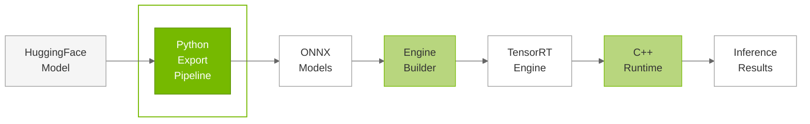
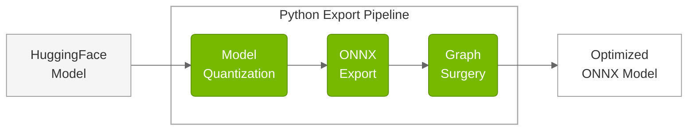
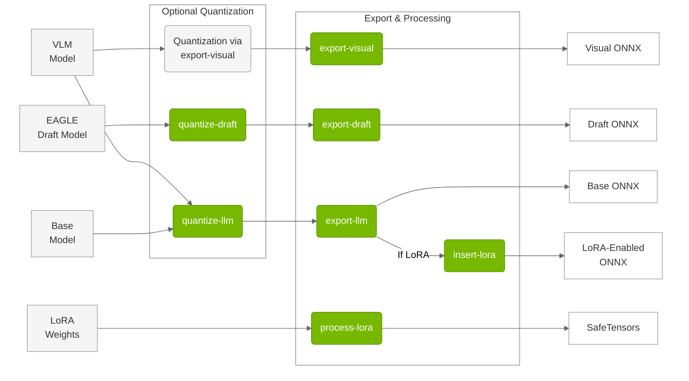

# Python Export Pipeline

## Overview

The TensorRT Edge-LLM Export Pipeline is a comprehensive Python-based system that transforms HuggingFace models into optimized ONNX representations suitable for TensorRT engine compilation. The pipeline handles model quantization, ONNX export, and specialized features like LoRA adaptation and multimodal processing.

### Purpose

The export pipeline serves as the **first stage** in the TensorRT Edge-LLM workflow:






### Pipeline Stages

1. **Model Loading**: Load HuggingFace model and tokenizer
2. **Quantization** (Optional): Apply precision reduction techniques
3. **ONNX Export**: Convert PyTorch model to ONNX format
4. **Graph Surgery**: Optimize ONNX graph for TensorRT
5. **Configuration Generation**: Create build configuration files


## Export Tools

TensorRT Edge-LLM provides specialized command-line tools to support quantization and export to ONNX format: 




> **Note**: Vision Language Models (VLMs) require **both** `export-llm` (for the language model component) and `export-visual` (for the vision encoder) to be fully exported. See the [Multimodal VLM Export](#multimodal-vlm-export) example below.

### Tool Overview

The `tensorrt-edgellm` package provides seven specialized command-line tools for different export scenarios:

| Tool | Inputs | Outputs | Description |
|------|--------|---------|-------------|
| **`quantize-llm`** | HuggingFace Model | Quantized Model | Quantize LLM models using NVIDIA ModelOpt. Supports FP8, INT4 AWQ, and NVFP4 quantization methods for memory reduction and performance optimization |
| **`export-llm`** | HuggingFace/Quantized Model | ONNX Model | Export LLM models to ONNX format. Handles standard LLMs and EAGLE base models with precision-specific optimizations and graph surgery |
| **`export-visual`** | VLM Model | Visual ONNX | Export visual encoders for multimodal models. Supports vision components with FP8 quantization and dynamic resolution |
| **`export-draft`** | Base + Draft Models | Draft ONNX | Export EAGLE draft models for speculative decoding. Specialized export for EAGLE3 draft model architectures with vocabulary mapping support |
| **`quantize-draft`** | Base + Draft Models | Quantized Draft | Quantize EAGLE draft models. Specialized quantization for draft models using base model inputs for calibration |
| **`insert-lora`** | ONNX Model | LoRA-enabled ONNX | Insert LoRA patterns into existing ONNX models. Adds dynamic LoRA support to ONNX models by modifying the computational graph |
| **`process-lora`** | LoRA Weights | SafeTensors | Process LoRA weights for runtime use. Processes LoRA adapter weights according to TensorRT Edge-LLM specifications for runtime loading |


---

## Quantization Methods

The export pipeline supports multiple quantization methods optimized for different hardware platforms and performance requirements:

| Method | Description | Precision | Platform Requirements | Memory Reduction |
|--------|-------------|-----------|----------------------|------------------|
| **FP16** | Half-precision floating point | 16-bit | All platforms | Baseline |
| **FP8** | 8-bit floating point | 8-bit | **SM89+** (Ada Lovelace and newer) | 2x |
| **INT8 SQ** | 8-bit SmoothQuant | 8-bit | All platforms | 2x |
| **INT4 AWQ** | 4-bit integer with AWQ | 4-bit | All platforms | 4x |
| **INT4 GPTQ** | 4-bit GPTQ weight quantization | 4-bit | All platforms | 4x |
| **NVFP4** | NVIDIA 4-bit floating point | 4-bit | **SM100+** (Blackwell and newer) | 4x |

### Quantization Details

**FP16 (Baseline)**
- Standard half-precision floating point
- Universal compatibility across all platforms
- Best accuracy, largest memory footprint
- Recommended for validation and accuracy baselines

**FP8 (General Purpose)**
- 8-bit floating point quantization
- 2x memory reduction with minimal accuracy loss
- Requires **SM89+** (Ada Lovelace generation or newer GPUs)
- Automatic calibration using sample data
- **FP8 Vision Encoder**: Supported for visual models
- **FP8 LM Head**: Supported for language model heads

**INT8 SQ (SmoothQuant)**
- 8-bit integer quantization with SmoothQuant algorithm
- Supported on all platforms, primarily for Ampere generation
- Use FP8 or NVFP4 on Blackwell generation for better accuracy and performance

**INT4 AWQ (Activation-Aware Weight Quantization)**
- 4-bit integer weight quantization
- Uses activation statistics for optimal quantization
- 4x memory reduction
- Good accuracy preservation with proper calibration
- Supported on all platforms

**INT4 GPTQ**
- 4-bit GPTQ weight quantization
- Can load quantized models from HuggingFace directly
- No additional quantization step needed for GPTQ checkpoints
- Install: `BUILD_CUDA_EXT=0 pip install -v gptqmodel --no-build-isolation`
- Supported on all platforms

**NVFP4 (NVIDIA Floating Point 4-bit)**
- NVIDIA's proprietary 4-bit floating point format
- Hardware-accelerated on **SM100+** (Blackwell generation and newer GPUs)
- 4x memory reduction with optimal performance
- Recommended for Thor platforms
- **NVFP4 LM Head**: Supported for language model heads

**Note**: INT4 GPTQ models can be loaded directly from HuggingFace Hub or quantized using [GPTQModel](https://github.com/ModelCloud/GPTQModel). No additional quantization step with `tensorrt-edgellm-quantize-llm` is required for pre-quantized GPTQ checkpoints.

---

## Security and Model Integrity

**⚠️ USER RESPONSIBILITY**: Users are responsible for verifying the integrity of all model artifacts (base models, LoRA weights, tokenizers, configs) before exporting models to TensorRT Edge-LLM format.

### Model Signing and Verification

It is **strongly recommended** to use the [model-signing](https://github.com/sigstore/model-transparency) package to sign and verify models before inference.

**Installation:**
```bash
pip install model-signing
```

**Basic Usage:**
```bash
# Sign a model
model_signing sign /path/to/your/model --signature model.sig

# Verify a model
model_signing verify /path/to/your/model \
  --signature model.sig \
  --identity "$identity" \
  --identity_provider "$oidc_provider"
```

**For more details**, refer to the [model-signing documentation](https://github.com/sigstore/model-transparency)

---

## Usage Examples

### Standard LLM Export

```bash
# Step 1: Quantize model (optional)
tensorrt-edgellm-quantize-llm \
  --model_dir Qwen/Qwen2.5-0.5B-Instruct \
  --quantization fp8 \
  --output_dir quantized/qwen2.5-0.5b-fp8

# Step 2: Export to ONNX
tensorrt-edgellm-export-llm \
  --model_dir quantized/qwen2.5-0.5b-fp8 \
  --output_dir onnx_models/qwen2.5-0.5b
```

### Multimodal VLM Export

```bash
# Export LLM component (Same as LLM)
tensorrt-edgellm-export-llm \
  --model_dir Qwen/Qwen2.5-VL-3B-Instruct \
  --output_dir onnx_models/qwen2.5-vl-3b

# Export visual encoder
tensorrt-edgellm-export-visual \
  --model_dir Qwen/Qwen2.5-VL-3B-Instruct \
  --output_dir onnx_models/qwen2.5-vl-3b/visual_enc_onnx
```

### EAGLE3 Speculative Decoding Export

```bash
# Download draft model from HF or prepare your own. Install git lfs first using https://git-lfs.com
git clone https://huggingface.co/Rayzl/qwen2.5-vl-7b-eagle3-sgl
cd qwen2.5-vl-7b-eagle3-sgl
git lfs pull

# Quantize base model
tensorrt-edgellm-quantize-llm \
  --model_dir Qwen/Qwen2.5-VL-7B-Instruct \
  --quantization fp8 \
  --output_dir quantized/qwen2.5-vl-7b-base

# Export base model
tensorrt-edgellm-export-llm \
  --model_dir quantized/qwen2.5-vl-7b-base \
  --output_dir onnx_models/qwen2.5-vl-7b_eagle3_base \
  --is_eagle_base

# Quantize draft model
tensorrt-edgellm-quantize-draft \
  --base_model_dir Qwen/Qwen2.5-VL-7B-Instruct \
  --draft_model_dir qwen2.5-vl-7b-eagle3-sgl \
  --quantization fp8 \
  --output_dir quantized/qwen2.5-vl-7b-draft

# Export draft model
tensorrt-edgellm-export-draft \
  --draft_model_dir quantized/qwen2.5-vl-7b-draft \
  --base_model_dir Qwen/Qwen2.5-VL-7B-Instruct \
  --output_dir onnx_models/qwen2.5-vl-7b_eagle3_draft \
  --use_prompt_tuning

# Export visual encoder
tensorrt-edgellm-export-visual \
  --model_dir Qwen/Qwen2.5-VL-7B-Instruct \
  --output_dir onnx_models/qwen2.5-vl-7b/visual_enc_onnx

```

### LoRA-Enabled Export

```bash
# Export base model
tensorrt-edgellm-export-llm \
  --model_dir Qwen/Qwen2.5-0.5B-Instruct \
  --output_dir onnx_models/qwen2.5-0.5b

# Insert LoRA support. This is LoRA-independent
tensorrt-edgellm-insert-lora \
  --onnx_dir onnx_models/qwen2.5-0.5b

# Download LoRA model(s) that you want to serve. This is just an example.
git clone https://huggingface.co/madhurjindal/Jailbreak-Detector-2-XL
cd Jailbreak-Detector-2-XL
git lfs pull

# Process LoRA weights
tensorrt-edgellm-process-lora \
  --input_dir Jailbreak-Detector-2-XL \
  --output_dir lora_weights
```

---

## Best Practices

### Security

1. **Verify model integrity** before export (see [Security and Model Integrity](#security-and-model-integrity))
2. **Sign models** before deployment using [model-signing](https://github.com/sigstore/model-transparency)

### Model Selection

1. **Choose appropriate quantization**: Match precision to platform capabilities
2. **Validate accuracy**: Test quantized models against FP16 baseline
3. **Consider memory constraints**: Use INT4/NVFP4 for memory-limited platforms

### Quantization Strategy

1. **Start with FP16**: Establish accuracy baseline
2. **Try FP8 for accuracy**: Best balance of accuracy and memory reduction on SM89+ hardware
3. **Use INT4 for fast decoding**: When prefill length is short and decode performance is critical
4. **Leverage NVFP4 on Thor**: Optimal prefill and decode performance on Thor

### Export Workflow

1. **Validate model loading**: Ensure model loads correctly from HuggingFace
2. **Check tokenizer compatibility**: Verify tokenizer exports properly
3. **Test ONNX output**: Validate ONNX model with ONNX Runtime
4. **Document configurations**: Save export parameters for reproducibility

### Performance Optimization

1. **Calibration data quality**: Use representative data for quantization
2. **Batch export**: Export multiple models in parallel when possible
3. **Cache downloads**: Reuse downloaded models across exports
4. **Monitor memory usage**: Track peak memory during export

---

## Common Issues and Solutions

### Issue: GPU Out of Memory During Export or Quantization

**Solution**: 
1. Change to a larger GPU. Empirically a 40GB GPU is enough for 4B or less model and 80GB GPU is enough for 8B or less.   
2. You may try `--device cpu` flag during quantization and export. However, CPU support may fail for some precisions.


### Issue: Quantization Degrades Accuracy

**Solution**: 

1. Increase calibration dataset size or use less aggressive quantization

```bash
# Use FP8 instead of INT4 for better accuracy
tensorrt-edgellm-quantize-llm \
  --model_dir model_name \
  --output_dir quantized/model_name \
  --quantization fp8 \  # Better accuracy than int4, nvfp4, or int8_sq
  --calib_size 512      # Increase from default
```

2. Change the quantization recipe in `tensorrt_edgellm/quantization/llm_quantization.py` or `tensorrt_edgellm/quantization/visual_quantization.py` to disable quantization for most sensitive layers. Follow the documentation of [NVIDIA Model Optimizer](https://nvidia.github.io/Model-Optimizer/)

---

## Next Steps

After exporting your model to ONNX:

1. **Build TensorRT Engine**: Use the [Engine Builder](03.2_Engine_Builder.md) to compile ONNX to TRT
2. **Deploy with C++ Runtime**: Use the [C++ Runtime](04.1_C++_Runtime_Overview.md) for inference
3. **Run Examples**: Try the [Examples](05_Examples.md) to validate your export

---

## Additional Resources

- **Model Signing**: [model-signing package](https://github.com/sigstore/model-transparency)
- **Python API Documentation**: Refer to the `tensorrt_edgellm/` directory
- **Quantization Details**: Refer to [NVIDIA Model Optimizer](https://nvidia.github.io/Model-Optimizer/)
- **ONNX Format**: Refer to [ONNX GitHub](https://github.com/onnx/onnx)
- **Model Support**: Refer to [Supported Models](02_Supported_Models.md)

