# Engine Builder

## Overview

The TensorRT Edge-LLM Engine Builder is a C++ component that converts ONNX models into optimized TensorRT engines specifically designed for edge deployment. The builder abstracts the complexity of TensorRT engine compilation, providing specialized builders for different model architectures.

### Purpose

The Engine Builder serves as the **second stage** in the TensorRT Edge-LLM workflow:

```mermaid
%%{init: {'theme':'neutral', 'themeVariables': {'primaryColor':'#76B900','primaryTextColor':'#fff','primaryBorderColor':'#5a8f00','lineColor':'#666','edgeLabelBackground':'#ffffff','labelTextColor':'#000','clusterBkg':'#ffffff','clusterBorder':'#999'}}}%%
graph LR
    HF_MODEL[HuggingFace<br>Model]
    PYTHON_EXPORT[Python<br>Export<br>Pipeline]
    ONNX_FILES[ONNX<br>Models]
    TRT_ENGINE[TensorRT<br>Engine]
    CPP_RUNTIME[C++<br>Runtime]
    OUTPUT[Inference<br>Results]
    
    subgraph BUILDER_SG [" "]
        ENGINE_BUILDER[Engine<br>Builder]
    end
    
    HF_MODEL --> PYTHON_EXPORT
    PYTHON_EXPORT --> ONNX_FILES
    ONNX_FILES --> ENGINE_BUILDER
    ENGINE_BUILDER --> TRT_ENGINE
    TRT_ENGINE --> CPP_RUNTIME
    CPP_RUNTIME --> OUTPUT
    
    classDef inputNode fill:#f5f5f5,stroke:#999,stroke-width:1px,color:#333
    classDef nvLightNode fill:#b8d67e,stroke:#76B900,stroke-width:1px,color:#333
    classDef nvNode fill:#76B900,stroke:#5a8f00,stroke-width:1px,color:#fff
    classDef itemNode fill:#ffffff,stroke:#999,stroke-width:1px,color:#333
    classDef darkNode fill:#ffffff,stroke:#999,stroke-width:1px,color:#333
    classDef greenSubGraph fill:none,stroke:#76B900,stroke-width:1.5px
    
    class HF_MODEL inputNode
    class PYTHON_EXPORT,CPP_RUNTIME nvLightNode
    class ENGINE_BUILDER nvNode
    class ONNX_FILES,TRT_ENGINE itemNode
    class OUTPUT darkNode
    class BUILDER_SG greenSubGraph
```





**Key Responsibilities**:
- Parse ONNX models and extract network structure
- Configure optimization profiles for dynamic shapes
- Compile TensorRT engines with platform-specific optimizations
- Generate runtime configuration files
- Handle model-specific requirements (EAGLE, VLM, LoRA)

---

## Compatibility and Model Integrity

**⚠️ VERSION COMPATIBILITY**: ONNX models and TensorRT engines are **NOT portable** across different versions of TensorRT Edge-LLM or TensorRT. Always re-export ONNX models and rebuild engines when upgrading versions.

**⚠️ USER RESPONSIBILITY**: Users are responsible for verifying model integrity before export and build, validating outputs, and maintaining proper model sanity throughout the pipeline. See the [Security and Model Integrity](03.1_Python_Export_Pipeline.md) section in the Python Export Pipeline guide for verification best practices.

---

## Build Process Workflow

```mermaid
%%{init: {'theme':'neutral', 'themeVariables': {'primaryColor':'#76B900','primaryTextColor':'#fff','primaryBorderColor':'#5a8f00','lineColor':'#666','edgeLabelBackground':'#ffffff','labelTextColor':'#000','clusterBkg':'#ffffff','clusterBorder':'#999'}}}%%
graph LR
    subgraph INPUT_STAGE [" "]
      INPUT_SPACER_LEFT
      ONNX_INPUT[ONNX Models<br>+ Export Configs]
    end
    
    subgraph ENGINE_BUILDER ["Engine Builder"]
        BUILDER_SPACER_1
        BUILDER_SPACER_2
        LLM_BUILDER[LLM<br>Builder]
        TEXT_LLM("← IF LLM")
        TEXT_VISUAL("IF Vision Encoder →")
        VISION_BUILDER[Vision Encoder<br>Builder]
        
        PLUGIN_LOADING( 1 <br>Plugin<br>Loading)
        CONFIG_PARSING( 2 <br>Configuration<br>Parsing)
        NETWORK_CREATION( 3 <br>Network<br>Creation)
        MODEL_TYPE( 4 <br>Model Type<br>Detection)
        ONNX_PARSING( 5 <br>ONNX<br>Parsing)
        PROFILE_SETUP( 6 <br>Optimization Profile<br>Setup)
        ENGINE_COMPILATION( 7 <br>Engine Compilation<br>*via TensorRT Builder*)
        FILE_MANAGEMENT( 8 <br>File<br>Management)
        BUILDER_SPACER_BOTTOM
    end

    INPUT_SPACER_LEFT -.-> BUILDER_SPACER_1 -.-> BUILDER_SPACER_2 -.-> LLM_BUILDER -.-> TEXT_LLM -.-> TEXT_VISUAL -.-> VISION_BUILDER
    
    linkStyle 0 stroke:transparent
    linkStyle 1 stroke:transparent  
    linkStyle 2 stroke:transparent
    linkStyle 3 stroke:transparent
    linkStyle 4 stroke:transparent
    linkStyle 5 stroke:transparent
    
    subgraph RESULTS [" "]
        RUNTIME_CONFIG[Runtime<br>Config]
        TOKENIZER_FILES[Tokenizer<br>Files]
        TRT_ENGINE[TensorRT<br>Engine]
        EAGLE_MAPPINGS[EAGLE<br>Mappings]
    end
    
    ONNX_INPUT --> PLUGIN_LOADING
    PLUGIN_LOADING --> CONFIG_PARSING
    CONFIG_PARSING --> NETWORK_CREATION
    NETWORK_CREATION --> MODEL_TYPE
    MODEL_TYPE --> ONNX_PARSING
    ONNX_PARSING --> PROFILE_SETUP
    PROFILE_SETUP --> ENGINE_COMPILATION
    ENGINE_COMPILATION --> FILE_MANAGEMENT
    FILE_MANAGEMENT --> RUNTIME_CONFIG
    FILE_MANAGEMENT --> TOKENIZER_FILES
    FILE_MANAGEMENT --> TRT_ENGINE
    FILE_MANAGEMENT -->|IF LLM Builder<br>& IF EAGLE| EAGLE_MAPPINGS
    
    classDef greyNode fill:#f5f5f5,stroke:#999,stroke-width:1px,color:#333
    classDef nvNode fill:#76B900,stroke:#5a8f00,stroke-width:1px,color:#fff
    classDef darkNode fill:#ffffff,stroke:#999,stroke-width:1px,color:#333
    classDef inputNode fill:#f5f5f5,stroke:#999,stroke-width:1px,color:#333
    classDef itemNode fill:#ffffff,stroke:#999,stroke-width:1px,color:#333
    classDef greySubGraph fill:none,stroke:#bbb,stroke-width:1px
    classDef greenSubGraph fill:none,stroke:#76B900,stroke-width:1.5px
    classDef contextBox fill:none,stroke:transparent
    classDef invisibleNode fill:transparent,stroke:transparent   


    classDef invisible fill:transparent,stroke:transparent,color:transparent,font-size:1px
    classDef invisibleSubGraph fill:transparent,stroke:transparent
    classDef textOnly fill:transparent,stroke:transparent
    
    class VISION_BUILDER,LLM_BUILDER nvNode
    class TEXT_LLM,TEXT_VISUAL textOnly
    class ONNX_INPUT inputNode
    class RUNTIME_CONFIG,TOKENIZER_FILES,TRT_ENGINE,EAGLE_MAPPINGS darkNode
    class PLUGIN_LOADING,CONFIG_PARSING,NETWORK_CREATION,MODEL_TYPE,ONNX_PARSING,PROFILE_SETUP,ENGINE_COMPILATION,FILE_MANAGEMENT greyNode
    class INPUT_SPACER_LEFT,BUILDER_SPACER_1,BUILDER_SPACER_2,BUILDER_SPACER_BOTTOM invisible
    class INPUT_STAGE,RESULTS contextBox
    class ENGINE_BUILDER greenSubGraph
```




For EAGLE3 speculative decoding, the LLM Builder executes this same 8-stage workflow **twice** with different configurations to create both base and draft models. This approach leverages the same optimization pipeline while producing specialized engines for each role in the speculative decoding process.

---


## Component Overview

The Engine Builder consists of two main components designed to handle different aspects of multimodal AI:

| Component | Description |
|-----------|-------------|
| **LLM Builder** | Converts language model ONNX files into optimized TensorRT engines. Supporting: Standard LLMs, EAGLE3 speculative decoding, VLM language components, LoRA adaptations |
| **Visual Encoder Builder** | Converts visual encoder ONNX files into optimized TensorRT engines for multimodal models. Supporting: Dynamic image token generation, Multiple multimodal architectures, Variable resolution support |


---

## Build Process Stages

Both the LLM Builder and Visual Encoder Builder follow a systematic multi-stage process to convert ONNX models into optimized TensorRT engines. The build process includes optional debugging steps that log network information for troubleshooting and validation purposes.

| Step | General Description | LLM Builder | Visual Encoder Builder |
|------|---------------------|-------------|------------------------|
| **1. Plugin Loading** | Loads TensorRT Edge-LLM custom plugins required for model-specific operations | Attention mechanisms, quantization operations, autoregressive generation patterns | Vision processing operations, image patch handling, vision transformer components |
| **2. Configuration Parsing** | Extracts model parameters and build settings from configuration files | Parses `config.json` for EAGLE settings, LoRA configurations, sequence length limits | Parses `vision_config` section for image token ranges, architecture-specific parameters |
| **3. Network Creation** | Creates TensorRT network definition with strongly-typed tensors | Autoregressive language generation with attention mechanisms | Vision processing with image patch handling and feature extraction |
| **4. Model Type Detection** | Identifies the specific model architecture and selects appropriate ONNX files | Standard LLM, EAGLE base/draft, VLM language component, LoRA-enabled. Selects `lora_model.onnx` if `maxLoraRank > 0`, otherwise `model.onnx` | Multimodal vision encoders. Always uses `model.onnx` |
| **5. ONNX Parsing** | Parses the ONNX model file and populates the TensorRT network with the model's computational graph | Attention layers, embedding layers, autoregressive components | Vision transformer layers, patch embedding, image processing components |
| **6. Optimization Profile Setup** | Configures optimization profiles for dynamic input shapes and batch processing | Dual-phase profiles (context/prefill and generation/decode phases) for various model types | Single profile for image processing with dynamic image token counts and variable resolutions |
| **7. Engine Compilation** | Invokes the TensorRT Builder API (`nvinfer1::createInferBuilder()` and `builder->buildSerializedNetwork()`) to compile the network into an optimized TensorRT engine | Autoregressive generation, attention patterns, memory efficiency | Vision transformer workloads, image processing, feature extraction |
| **8. File Management** | Copies and generates necessary runtime files and configurations with automatic directory creation | Runtime config, tokenizer files (`tokenizer.json`, `tokenizer_config.json`), EAGLE mappings (`d2t.safetensors`), model-specific configs. Creates engine directory if needed | Runtime configuration only (`config.json` with builder settings). Creates engine directory if needed. No tokenizer or EAGLE files |

---

## LLM Builder

The **LLM Builder** is the core component responsible for converting language model ONNX files into optimized TensorRT engines. It provides a unified interface for building various types of language models while handling the complexity of model-specific optimizations and configurations.

### Supported Model Types

The LLM Builder adapts its optimization profiles and tensor configurations based on the specific model type and requirements:

**Standard LLMs** (`setupVanillaProfiles`):
- **Input Tensors**: Input IDs, attention masks, position embeddings
- **Dynamic Shapes**: Variable sequence lengths and batch sizes
- **KV Cache**: Key-value cache tensors for autoregressive generation

**EAGLE Models** (`setupEagleProfiles`):
- **Base Models**: Standard LLM inputs plus EAGLE-specific attention patterns and tree verification
- **Draft Models**: Hidden states from draft, tree attention masks, speculation tokens
- **Tree Size Limits**: Configurable maximum tree sizes for verification (`maxVerifyTreeSize`) and draft generation (`maxDraftTreeSize`)
- **Vocabulary Mapping**: Draft-to-target token mapping for EAGLE3 (`d2t.safetensors` file)

**Vision-Language Models** (`setupVLMProfiles`):
- **Image Embeddings**: Dynamic image token inputs from visual encoder
- **Multimodal Integration**: Coordination between vision and language processing
- **Token Flexibility**: Variable image token counts based on input resolution

**LoRA-Enabled Models** (`setupLoraProfiles`):
- **Adapter Matrices**: Dynamic LoRA weight matrices with configurable ranks
- **Runtime Switching**: Support for multiple LoRA adapters per model
- **Memory Optimization**: Efficient adapter weight storage and loading

### Dual-Phase Optimization

The LLMBuilder creates two optimization profiles for efficient inference:

**Context Profile** (Prefill Phase):
- **Purpose**: Optimized for processing input prompts and initial context
- **Characteristics**: Large sequence lengths, parallel processing, memory-intensive
- **Batch Sizes**: Typically smaller batches due to memory constraints

**Generation Profile** (Decode Phase):
- **Purpose**: Optimized for autoregressive token generation
- **Characteristics**: Single token generation, sequential processing, compute-intensive
- **Batch Sizes**: Larger batches possible due to smaller memory footprint

### Output Generation

Based on model type, the LLMBuilder produces different output configurations:

**Standard Models**:
- `llm.engine`: TensorRT engine file
- `config.json`: Runtime configuration with model parameters
- Tokenizer files: `tokenizer.json`, `tokenizer_config.json`

**EAGLE Base Models**:
- `eagle_base.engine`: Base model TensorRT engine
- `base_config.json`: Base model runtime configuration
- Tokenizer files: Shared tokenizer configuration

**EAGLE Draft Models**:
- `eagle_draft.engine`: Draft model TensorRT engine
- `draft_config.json`: Draft model runtime configuration
- `d2t.safetensors`: Draft-to-target vocabulary mapping

### Hardware Optimization

The LLMBuilder automatically applies platform-specific optimizations for maximum performance on edge hardware:
- **Precision Selection**: FP16, FP8, INT4, NVFP4 based on hardware capabilities
- **Memory Layout**: Optimized tensor layouts for target GPU architecture
- **Kernel Selection**: Hardware-specific kernel implementations for maximum performance

---

## Visual Encoder Builder

The **Visual Encoder Builder** is specialized for converting visual encoder ONNX files into optimized TensorRT engines for multimodal AI applications. It handles the complexity of different vision architectures while providing dynamic image processing capabilities.

### Supported Vision Architectures

The Visual Encoder Builder supports multiple vision architectures with architecture-specific optimization profiles:

**Qwen2/2.5/3-VL Models** (`setupQwenViTProfile`):
- **Architecture**: Qwen2-VL and Qwen2.5-VL vision encoders
- **Processing**: Dynamic image patches with 4x spatial merge operations
- **Token Generation**: Variable image tokens based on input resolution
- **Window Attention**: Qwen2.5-VL includes window attention mechanisms for improved efficiency

**InternVL Models** (`setupInternPhi4ViTProfile`):
- **Architecture**: InternVL3 vision encoder with 0.5 downsampling ratio(downsampling by a factor of 2 in each dimension, resulting in a 4× reduction in tokens).
- **Constraints**: Image tokens must be multiples of 256 for optimal processing
- **Configuration**: Configurable input channels (typically 3 for RGB)
- **Resolution**: Fixed image size processing with dynamic token output

**Phi-4-multimodal Models** (`setupInternPhi4ViTProfile`):  
- **Architecture**: Phi-4-multimodal vision encoder with 0.5 downsampling ratio(downsampling by a factor of 2 in each dimension, resulting in a 4× reduction in tokens).
- **Constraints**: Image tokens must be multiples of 256 for optimal processing
- **Configuration**: Configurable input channels (typically 3 for RGB)
- **Resolution**: Fixed image size processing with dynamic token output

### Vision-Specific Optimization

Unlike LLM models, visual encoders use a single optimization profile optimized for image processing:
- **Purpose**: Image encoding and feature extraction
- **Dynamic Dimensions**: Variable image resolutions and patch counts
- **Memory Pattern**: Batch-oriented processing for multiple images
- **Token Output**: Dynamic image token generation based on input complexity

### Output Generation

The Visual Encoder Builder produces engines specifically designed for multimodal integration:
- `visual.engine`: TensorRT engine optimized for visual processing
- `config.json`: Runtime configuration with vision model parameters and builder settings
- **Token Interface**: Produces image tokens compatible with LLM input requirements
- **Dynamic Sizing**: Supports variable image token counts based on input resolution

### Hardware Optimization

Visual processing benefits from specific GPU optimizations tailored for vision transformer workloads:
- **Tensor Cores**: Leverages mixed-precision operations for vision transformers
- **Memory Bandwidth**: Optimized for high-resolution image processing
- **Batch Processing**: Efficient handling of multiple images simultaneously
- **Precision Selection**: Automatic FP16/FP8 selection based on hardware capabilities

---

## Usage Examples

### Standard LLM Build

```bash
./build/examples/llm/llm_build \
  --onnxDir=onnx_models/qwen2.5-0.5b \
  --engineDir=engines/qwen2.5-0.5b \
  --maxBatchSize=1 \
  --maxInputLen=1024 \
  --maxKVCacheCapacity=4096
```

### EAGLE Speculative Decoding Build

Base and draft engine directories should be the same.
```bash
# Build base model
./build/examples/llm/llm_build \
  --onnxDir=onnx_models/qwen2.5-vl-7b_eagle3_base \
  --engineDir=engines/qwen2.5-vl-7b_eagle3 \
  --maxBatchSize=1 \
  --maxInputLen=1024 \
  --maxKVCacheCapacity=4096 \
  --vlm \
  --minImageTokens=128 \
  --maxImageTokens=512 \
  --eagleBase

# Build draft model
./build/examples/llm/llm_build \
  --onnxDir=onnx_models/qwen2.5-vl-7b_eagle3_draft \
  --engineDir=engines/qwen2.5-vl-7b_eagle3 \
  --maxBatchSize=1 \
  --maxInputLen=1024 \
  --maxKVCacheCapacity=4096 \
  --vlm \
  --minImageTokens=128 \
  --maxImageTokens=512 \
  --eagleDraft

# Build visual encoder (required for VLM)
./build/examples/multimodal/visual_build \
  --onnxDir=onnx_models/qwen2.5-vl-7b/visual_enc_onnx \
  --engineDir=visual_engines/qwen2.5-vl-7b_eagle3 \
  --minImageTokens=128 \
  --maxImageTokens=512 \
  --maxImageTokensPerImage=512
```

### Multimodal VLM Build

```bash
# Build LLM engine
./build/examples/llm/llm_build \
  --onnxDir=onnx_models/qwen2.5-vl-3b \
  --engineDir=engines/qwen2.5-vl-3b \
  --maxBatchSize=1 \
  --maxInputLen=1024 \
  --maxKVCacheCapacity=4096 \
  --vlm \
  --minImageTokens=128 \
  --maxImageTokens=512

# Build visual encoder
./build/examples/multimodal/visual_build \
  --onnxDir=onnx_models/qwen2.5-vl-3b/visual_enc_onnx \
  --engineDir=visual_engines/qwen2.5-vl-3b \
  --minImageTokens=128 \
  --maxImageTokens=512 \
  --maxImageTokensPerImage=512
```

### LoRA-Enabled Build

```bash
./build/examples/llm/llm_build \
  --onnxDir=onnx_models/qwen2.5-0.5b \
  --engineDir=engines/qwen2.5-0.5b-lora \
  --maxBatchSize=1 \
  --maxLoraRank=64
```

---

## Best Practices

### Engine Building Strategy

1. **Optimize Batch Size**: Set `maxBatchSize` based on your workload
   - Interactive applications: 1-2
   - Batch processing: 4-8

2. **Configure Sequence Lengths**: Balance memory and use case
   - Short prompts: `maxInputLen=512`
   - Long context: `maxInputLen=2048` or higher
   - KV-Cache capacity: `maxKVCacheCapacity` = `maxInputLen` + expected output length

3. **Set Image Token Ranges for VLMs**: Configure appropriate token ranges for multimodal models
   - InternVL and Phi-4-multimodal: Image tokens must be multiples of 256
   - Qwen-VL: Flexible image token counts based on dynamic patching
   - Use `--minImageTokens` and `--maxImageTokens` to set the range
   - Set `--maxImageTokensPerImage` for batch processing limits

4. **Enable Verbose Logging**: Use `--verbose` for debugging build issues


### Troubleshooting

**Out of Memory During Build**:
- Reduce `maxBatchSize`
- Reduce `maxInputLen` and `maxKVCacheCapacity`
- Use lighter quantization (INT4 instead of FP16)

**Build Takes Too Long**:
- Expected: 1-20 minutes depending on model size
- Use faster GPU for building
- Consider reducing optimization profile complexity

**Engine Not Loading**:
- Check TensorRT version compatibility
- Verify ONNX model integrity
- Check plugin library loading

---

## Next Steps

After building your TensorRT engine:

1. **Deploy with C++ Runtime**: Use the [C++ Runtime](04.1_C++_Runtime_Overview.md) for inference
2. **Run Examples**: Try the [Examples](05_Examples.md) to validate your engine
3. **Benchmark Performance**: Measure latency and throughput for your use case

---

## Additional Resources

- **Builder API**: Refer to the `cpp/builder/` directory
- **TensorRT Documentation**: [NVIDIA TensorRT](https://docs.nvidia.com/deeplearning/tensorrt/)
- **Plugin Development**: Refer to the `cpp/plugins/` directory
- **Build Examples**: Refer to `examples/llm/llm_build.cpp`

