# C++ Runtime Overview

## Overview

The TensorRT Edge-LLM C++ Runtime provides a comprehensive inference system for Large Language Models (LLMs) and Vision Language Models (VLMs) built on top of TensorRT. The runtime implements a layered architecture that manages the autoregressive decoding loop required for language model inference, handling everything from tokenization to final text generation.

### Purpose

The C++ Runtime serves as the **final stage** in the TensorRT Edge-LLM workflow:

```mermaid
%%{init: {'theme':'neutral', 'themeVariables': {'primaryColor':'#76B900','primaryTextColor':'#fff','primaryBorderColor':'#5a8f00','lineColor':'#666','edgeLabelBackground':'#ffffff','labelTextColor':'#000','clusterBkg':'#ffffff','clusterBorder':'#999'}}}%%
graph LR
    HF_MODEL[HuggingFace<br>Model]
    PYTHON_EXPORT[Python<br>Export<br>Pipeline]
    ONNX_FILES[ONNX<br>Models]
    ENGINE_BUILDER[Engine<br>Builder]
    TRT_ENGINE[TensorRT<br>Engine]
    OUTPUT[Inference<br>Results]
    
    subgraph RUNTIME_SG [" "]
        CPP_RUNTIME[C++<br>Runtime]
    end
    
    HF_MODEL --> PYTHON_EXPORT
    PYTHON_EXPORT --> ONNX_FILES
    ONNX_FILES --> ENGINE_BUILDER
    ENGINE_BUILDER --> TRT_ENGINE
    TRT_ENGINE --> CPP_RUNTIME
    CPP_RUNTIME --> OUTPUT
    
    classDef inputNode fill:#f5f5f5,stroke:#999,stroke-width:1px,color:#333
    classDef nvLightNode fill:#b8d67e,stroke:#76B900,stroke-width:1px,color:#333
    classDef nvNode fill:#76B900,stroke:#5a8f00,stroke-width:1px,color:#fff
    classDef itemNode fill:#ffffff,stroke:#999,stroke-width:1px,color:#333
    classDef darkNode fill:#ffffff,stroke:#999,stroke-width:1px,color:#333
    classDef greenSubGraph fill:none,stroke:#76B900,stroke-width:1.5px
    
    class HF_MODEL inputNode
    class PYTHON_EXPORT,ENGINE_BUILDER nvLightNode
    class CPP_RUNTIME nvNode
    class ONNX_FILES,TRT_ENGINE itemNode
    class OUTPUT darkNode
    class RUNTIME_SG greenSubGraph
```

---

## Runtime Architecture

The C++ runtime is organized around **two distinct, mutually exclusive runtime implementations** that serve different inference scenarios. Both runtimes share the same high-level API (`handleRequest`) but implement fundamentally different execution strategies:

| Component | Description |
|-----------|-------------|
| **LLM Inference Runtime** | Top-level orchestrator for standard and multimodal inference. Owns and coordinates all components for the inference pipeline. Creates and directly manages a single `LLMEngineRunner` instance (`mLLMEngineRunner`) that handles both prefill and generation phases. Manages memory allocation, request processing, tokenization, and response generation. Supports both text-only and multimodal (VLM) inference scenarios. |
| **LLM Inference SpecDecode Runtime** | Specialized runtime for EAGLE speculative decoding. Completely separate from the LLM Inference Runtime, owns and coordinates two distinct engine runners: `mBaseEngineRunner` (LLMEngineRunner) and `mDraftEngineRunner` (EagleDraftEngineRunner). Implements sophisticated EAGLE tree-based speculative generation with draft model candidate generation and base model verification. Handles draft vocabulary mapping for EAGLE3. |

---

## Next Steps

1. **Standard Inference**: Learn about the [LLM Inference Runtime](04.2_LLM_Inference_Runtime.md)
2. **EAGLE Speculative Decoding**: Refer to [LLM Inference SpecDecode Runtime](04.3_LLM_Inference_SpecDecode_Runtime.md)
3. **Advanced Features**: Explore [Advanced Runtime Features](04.4_Advanced_Runtime_Features.md)
4. **Try Examples**: Run the [Examples](05_Examples.md) to see the runtime in action

---

## Additional Resources

- **Runtime API**: Refer to the `cpp/runtime/` directory
- **Example Applications**: Refer to `examples/llm/` and `examples/multimodal/`
- **Architecture Overview**: Refer to [Overview](01.1_Overview.md)

