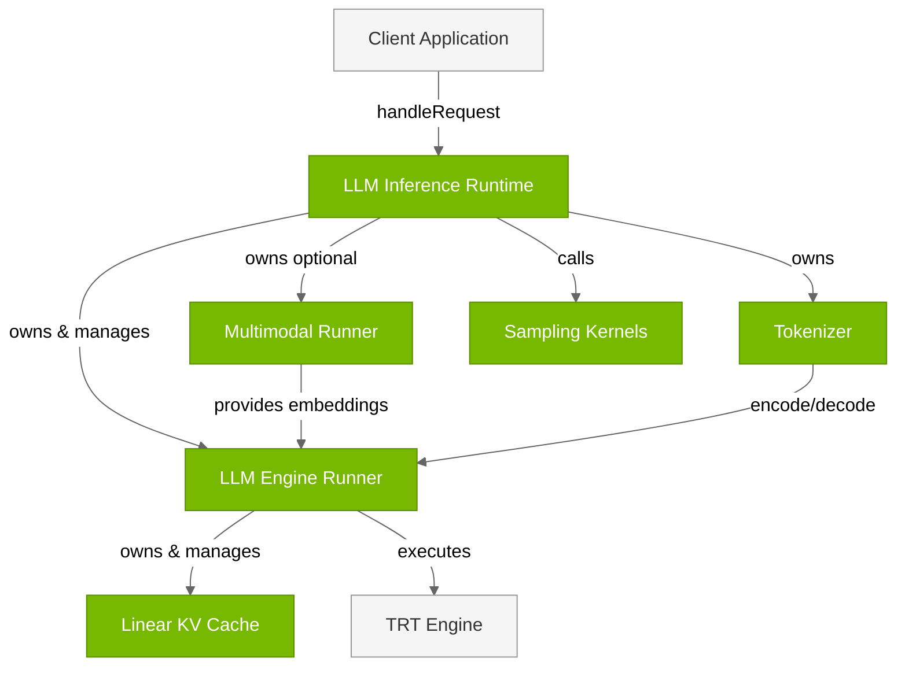

# LLM Inference Runtime

## Architecture


The **LLM Inference Runtime** provides standard autoregressive generation for both text-only and multimodal (VLM) inference using a single `LLMEngineRunner`.





### Key Components

| Component | Description |
|-----------|-------------|
| **LLM Engine Runner** | Executes TensorRT engines and manages dual-phase inference. Core engine execution component owned by LLM Inference Runtime (as `mLLMEngineRunner`). Handles separate TensorRT execution contexts for prefill and generation phases. Manages its own Linear KV Cache instance, produces logits that are consumed by the runtime's sampling calls, and provides CUDA graph optimization for reduced latency. Supports dynamic LoRA adapter switching. *Files:* `cpp/runtime/llmEngineRunner.{h,cpp}` |
| **Tokenizer** | HuggingFace-compatible text tokenization system. Converts between text and token IDs using Byte-Pair Encoding (BPE). The LLM Inference Runtime owns its own tokenizer instance. Supports various model vocabularies (GPT, Llama, Qwen) with configurable special tokens and preprocessing steps. *Files:* `cpp/tokenizer/tokenizer.{h,cpp}`, `preTokenizer.{h,cpp}`, `tokenEncoder.{h,cpp}` |
| **Multimodal Runner** | Vision processing for multimodal models (VLMs). Processes image inputs through Vision Transformer models and generates vision embeddings. Supports Qwen-VL and InternVL architectures with dynamic image token generation. Integrates vision embeddings with text tokens for multimodal inference. *Files:* `cpp/multimodal/multimodalRunner.{h,cpp}`, `qwenViTRunner.{h,cpp}`, `internViTRunner.{h,cpp}` |
| **Linear KV Cache** | Attention key-value cache management. The LLM Engine Runner maintains its own Linear KV Cache instance. Stores attention key-value pairs across inference steps for efficient autoregressive generation. Uses linear memory layout optimized for GPU access with support for batched processing and variable sequence lengths. *Files:* `cpp/runtime/linearKVCache.{h,cpp}` |
| **Sampling Kernels** | Token generation from model logits. Converts model output logits into probability distributions and samples the next token using configurable strategies (greedy, top-k, top-p, temperature). Called directly by the LLM Inference Runtime (not by engine runner) after engine execution produces logits. Operates on GPU for efficient batch processing. *Files:* `cpp/sampler/sampling.{cu,h}` |
| **TRT Engine** | TensorRT inference engine. Optimized TensorRT engine compiled from ONNX models. The LLM Inference Runtime uses a single engine loaded and executed by the LLM Engine Runner. Provides high-performance inference through TensorRT optimizations including kernel fusion, precision calibration, and memory optimization. *Files:* Built by `llm_build` (see Engine Builder section) |


## Inference Workflow

The LLM Inference Runtime implements a dual-phase processing architecture optimized for autoregressive language model generation.

```mermaid
%%{init: {'theme':'neutral', 'themeVariables': {'primaryColor':'#76B900','primaryTextColor':'#fff','primaryBorderColor':'#5a8f00','lineColor':'#666','edgeLabelBackground':'#ffffff','labelTextColor':'#000','clusterBkg':'#ffffff','clusterBorder':'#999'}}}%%
graph LR
    INPUT_PROMPT(Input<br/>Prompt) --> TOKENIZER(Tokenize)
    
    subgraph VIT_BOX ["Optional"]
        VIT_PROCESS(ViT<br>Processing)
    end
    
    TOKENIZER --> VIT_PROCESS
    VIT_PROCESS --> PREFILL_ENGINE(Prefill<br/>**TRT Engine**)
    
    PREFILL_ENGINE --> GENERATE_KV[Generate<br/>KV-Cache]
    GENERATE_KV --> SAMPLE_FIRST(Sample First<br/>Token)
    
    SAMPLE_FIRST --> GENERATION_ENGINE[Generation<br/>**TRT Engine** or<br>**CUDA Graph**]
    
    GENERATION_ENGINE --> UPDATE_KV(Update<br>KV Cache)
    UPDATE_KV --> SAMPLE_TOKEN(Sample Next<br/>Token)
    
    SAMPLE_TOKEN --> STOP_CHECK{Stop<br/>Condition?}
    STOP_CHECK -->|N| GENERATION_ENGINE
    STOP_CHECK -->|Y| OUTPUT_SEQUENCE(Generated<br/>Sequence)
    
    subgraph PHASE1 ["Phase 1: Prefill"]
        PREFILL_ENGINE
        GENERATE_KV
        SAMPLE_FIRST
    end
    
    subgraph PHASE2 ["Phase 2: Generation"]
        GENERATION_ENGINE
        UPDATE_KV
        SAMPLE_TOKEN
        STOP_CHECK
        OUTPUT_SEQUENCE
    end
    
    classDef greyNode fill:#f5f5f5,stroke:#999,stroke-width:1px,color:#333
    classDef darkNode fill:#ffffff,stroke:#999,stroke-width:1px,color:#333
    classDef nvNode fill:#76B900,stroke:#5a8f00,stroke-width:1px,color:#fff
    classDef nvLightNode fill:#b8d67e,stroke:#76B900,stroke-width:1px,color:#333
    classDef inputNode fill:#f5f5f5,stroke:#999,stroke-width:1px,color:#333
    classDef itemNode fill:#ffffff,stroke:#999,stroke-width:1px,color:#333
    classDef lightSubGraph fill:none,stroke:#aaa,stroke-width:1.5px
    classDef optionalBox fill:none,stroke:#aaa,stroke-width:1px,stroke-dasharray:5 5
    
    class INPUT_PROMPT inputNode
    class TOKENIZER,SAMPLE_FIRST,SAMPLE_TOKEN,VIT_PROCESS,STOP_CHECK,PREFILL_ENGINE,GENERATION_ENGINE greyNode
    class GENERATE_KV,UPDATE_KV nvLightNode
    class OUTPUT_SEQUENCE darkNode
    class PHASE1,PHASE2 lightSubGraph
    class VIT_BOX optionalBox
```





### Inference Phases

**Phase 1: Prefill Processing**

The prefill phase processes the entire input prompt in parallel to establish the initial inference state:

- **Input Processing**: Text is tokenized and padded to batch requirements
- **Multimodal Integration**: For VLMs, vision embeddings are processed through ViT components and integrated with text embeddings  
- **Parallel Execution**: All prompt tokens are processed simultaneously through transformer layers
- **KV-Cache Generation**: Key-value cache is populated for all prompt tokens
- **First Token Sampling**: Initial generated token is sampled from output logits

**Phase 2: Generation (Autoregressive Decode)**

The generation phase operates autoregressively, processing one token at a time:

- **Sequential Processing**: Each iteration processes the previously generated token
- **KV-Cache Reuse**: Leverages accumulated key-value cache from previous steps
- **CUDA Graph Optimization**: Optional CUDA graph capture reduces kernel launch overhead by 10-30%
- **Sampling Strategies**: Configurable token generation (greedy, top-k, top-p, temperature)
- **Stopping Criteria**: Continues until EOS token, maximum length, or custom conditions

---

## Usage Examples

### Standard LLM Inference

```cpp
#include "llmInferenceRuntime.h"

// Initialize runtime
LLMInferenceRuntime runtime(engineDir);

// Prepare request
InferenceRequest request;
request.inputText = "What is the capital of France?";
request.maxLength = 100;
request.temperature = 0.7;

// Execute inference
auto response = runtime.handleRequest(request);
std::cout << "Generated: " << response.outputText << std::endl;
```

### LoRA Adapter Switching

```cpp
// Load LoRA adapters
runtime.addLoraWeights("medical", "lora_weights/medical_adapter.safetensors");
runtime.addLoraWeights("legal", "lora_weights/legal_adapter.safetensors");

// Use medical adapter
runtime.switchLoraWeights("medical");
auto medical_response = runtime.handleRequest(medical_request);

// Switch to legal adapter
runtime.switchLoraWeights("legal");
auto legal_response = runtime.handleRequest(legal_request);

// Disable LoRA
runtime.switchLoraWeights("");
auto base_response = runtime.handleRequest(base_request);
```

### Multimodal VLM Inference

```cpp
// Initialize multimodal runtime
LLMInferenceRuntime runtime(engineDir, visualEngineDir);

// Prepare multimodal request
InferenceRequest request;
request.inputText = "What's in this image?";
request.imagePaths = {"image.jpg"};
request.maxLength = 150;

auto response = runtime.handleRequest(request);
std::cout << "Generated: " << response.outputText << std::endl;
```

---

## Next Steps

1. **Learn About Speculative Decoding**: Refer to [LLM Inference SpecDecode Runtime](04.3_LLM_Inference_SpecDecode_Runtime.md) for EAGLE support
2. **Explore Advanced Features**: Refer to [Advanced Runtime Features](04.4_Advanced_Runtime_Features.md) for CUDA graphs, LoRA, and more
3. **Try Examples**: Run the [Examples](05_Examples.md) to see the runtime in action
4. **Integrate into Application**: Use the runtime API in your application

---

## Additional Resources

- **Runtime API**: Refer to the `cpp/runtime/` directory
- **Example Applications**: Refer to `examples/llm/` and `examples/multimodal/`
- **Architecture Overview**: Refer to [Overview](01.1_Overview.md)


