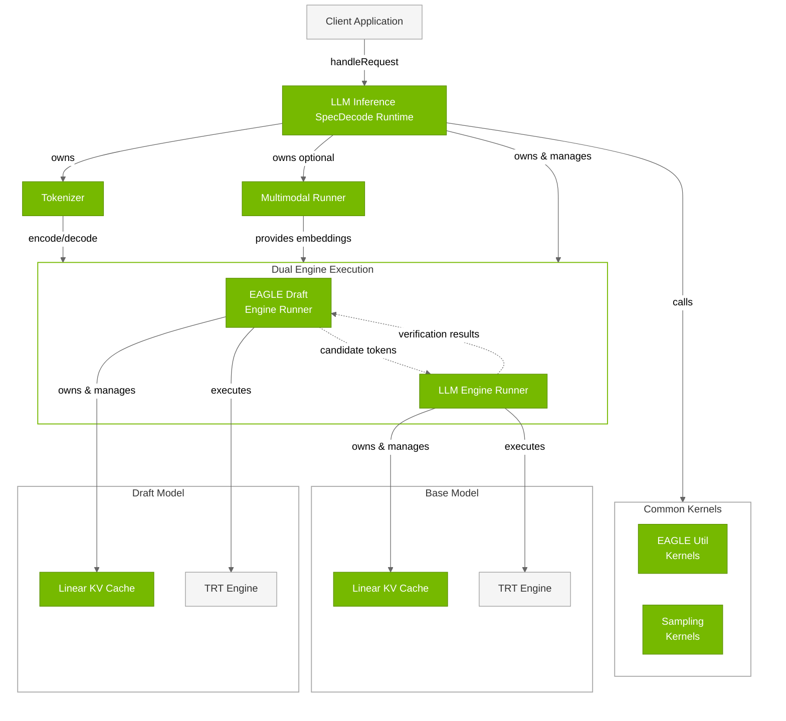

# LLM Inference SpecDecode Runtime

## Architecture

The **LLM Inference SpecDecode Runtime** implements EAGLE speculative decoding using **dual engines** (draft and base) for accelerated token generation. This runtime is completely separate from the LLM Inference Runtime and provides a specialized execution path optimized for EAGLE's tree-based speculative generation.




---


### Key Components


| Component | Description |
|-----------|-------------|
| **LLM Engine Runner (Base)** | Executes TensorRT engines and manages dual-phase inference for base model. Core engine execution component owned by LLM Inference SpecDecode Runtime (as `mBaseEngineRunner`). Handles separate TensorRT execution contexts for prefill and generation phases. Manages its own Linear KV Cache instance, produces logits that are consumed by the runtime's sampling calls. **Note**: CUDA graph optimization is not available in EAGLE SpecDecode mode. Supports dynamic LoRA adapter switching. *Files:* `cpp/runtime/llmEngineRunner.{h,cpp}` |
| **EAGLE Draft Engine Runner** | Specialized engine runner for EAGLE draft models. Executes draft model inference for speculative decoding. Owned by LLM Inference SpecDecode Runtime (as `mDraftEngineRunner`). Generates candidate token sequences that are verified by the base model's LLMEngineRunner. Maintains its own separate KV cache and execution contexts optimized for draft model characteristics and tree-based token generation. *Files:* `cpp/runtime/eagleDraftEngineRunner.{h,cpp}` |
| **Tokenizer** | HuggingFace-compatible text tokenization system. Converts between text and token IDs using Byte-Pair Encoding (BPE). The LLM Inference SpecDecode Runtime owns its own tokenizer instance. Supports various model vocabularies (GPT, Llama, Qwen) with configurable special tokens and preprocessing steps. *Files:* `cpp/tokenizer/tokenizer.{h,cpp}`, `preTokenizer.{h,cpp}`, `tokenEncoder.{h,cpp}` |
| **Multimodal Runner** | Vision processing for multimodal models (VLMs). Processes image inputs through Vision Transformer models and generates vision embeddings. Supports Qwen-VL and InternVL architectures with dynamic image token generation. Integrates vision embeddings with text tokens for multimodal inference. *Files:* `cpp/multimodal/multimodalRunner.{h,cpp}`, `qwenViTRunner.{h,cpp}`, `internViTRunner.{h,cpp}` |
| **Linear KV Cache** | Attention key-value cache management. Each engine runner maintains its own Linear KV Cache instance. Stores attention key-value pairs across inference steps for efficient autoregressive generation. Uses linear memory layout optimized for GPU access with support for batched processing and variable sequence lengths. *Files:* `cpp/runtime/linearKVCache.{h,cpp}` |
| **Sampling Kernels** | Token generation from model logits. Converts model output logits into probability distributions and samples the next token using configurable strategies (greedy, top-k, top-p, temperature). Called directly by the LLM Inference SpecDecode Runtime (not by engine runners) after engine execution produces logits. Operates on GPU for efficient batch processing. *Files:* `cpp/sampler/sampling.{cu,h}` |
| **EAGLE Util Kernels** | EAGLE speculative decoding utility kernels. Specialized CUDA kernels for EAGLE tree-based speculative decoding operations. Called directly by the LLM Inference SpecDecode Runtime (not by engine runners). Handles tree construction, candidate token generation, verification logic, and accept/reject mechanisms for speculative tokens. *Files:* `cpp/kernels/speculative/` |
| **TRT Engines (Dual)** | TensorRT inference engines (dual: base and draft). Optimized TensorRT engines compiled from ONNX models. The LLM Inference SpecDecode Runtime uses two separate engines (draft and base). Each engine is loaded and executed by its corresponding engine runner. Provides high-performance inference through TensorRT optimizations including kernel fusion, precision calibration, and memory optimization. *Files:* Built by `llm_build` (see Engine Builder section) |


## Inference Workflow


**Phase 1: Prefill**

```mermaid
%%{init: {'theme':'neutral', 'themeVariables': {'primaryColor':'#76B900','primaryTextColor':'#fff','primaryBorderColor':'#5a8f00','lineColor':'#666','edgeLabelBackground':'#ffffff','labelTextColor':'#000','clusterBkg':'#ffffff','clusterBorder':'#999'}}}%%
graph LR
    INPUT_PROMPT(Input<BR>Prompt)
    TOKENIZER(Tokenize)
    
    subgraph VIT_BOX ["Optional"]
        VIT_PROCESS(ViT<br>Processing)
    end
    
    BASE_PREFILL_ENGINE[Base Prefill<BR>**TRT Engine**]
    BASE_KV_GEN(Generate Base<BR>KV-Cache, Logits <BR>& Hidden States)
    BASE_SAMPLE(Sample)
    DRAFT_PREFILL_ENGINE[Draft Prefill<BR>**TRT Engine**]
    DRAFT_KV_GEN(Generate Draft<BR>KV-Cache, Logits<BR>& Hidden States)
    PHASE2_START(Phase 2:<BR>Generation)
    
    INPUT_PROMPT --> TOKENIZER
    TOKENIZER --> VIT_PROCESS
    VIT_PROCESS --> BASE_PREFILL_ENGINE
    BASE_PREFILL_ENGINE --> BASE_KV_GEN
    BASE_KV_GEN --> BASE_SAMPLE
    BASE_SAMPLE --> DRAFT_PREFILL_ENGINE
    DRAFT_PREFILL_ENGINE --> DRAFT_KV_GEN
    DRAFT_KV_GEN --> PHASE2_START
    
    classDef greyNode fill:#f5f5f5,stroke:#999,stroke-width:1px,color:#333
    classDef nvNode fill:#76B900,stroke:#5a8f00,stroke-width:1px,color:#fff
    classDef nvLightNode fill:#b8d67e,stroke:#76B900,stroke-width:1px,color:#333
    classDef inputNode fill:#f5f5f5,stroke:#999,stroke-width:1px,color:#333
    classDef optionalBox fill:none,stroke:#aaa,stroke-width:1px,stroke-dasharray:5 5
    
    class PHASE2_START nvNode
    class INPUT_PROMPT inputNode
    class TOKENIZER,VIT_PROCESS,BASE_PREFILL_ENGINE,DRAFT_PREFILL_ENGINE,BASE_SAMPLE greyNode
    class BASE_KV_GEN,DRAFT_KV_GEN nvLightNode
    class VIT_BOX optionalBox
```



**Phase 2: Generation**

```mermaid
%%{init: {'theme':'neutral', 'themeVariables': {'primaryColor':'#76B900','primaryTextColor':'#fff','primaryBorderColor':'#5a8f00','lineColor':'#666','edgeLabelBackground':'#ffffff','labelTextColor':'#000','clusterBkg':'#ffffff','clusterBorder':'#999'}}}%%
graph LR
    PHASE1_INPUT(Phase 1:<BR>Prefill)
    DRAFT_ACCEPT_ENGINE[Draft Accept Token<BR>**TRT Engine**]
    DRAFT_KV_GEN2(Generate Draft<BR>KV-Cache, Logits<BR>& Hidden States)
    
    subgraph TREE_CONSTRUCTION ["Draft Tree Construction"]
        DRAFT_PROPOSAL_ENGINE[Draft Batch Proposal<BR>**TRT Engine**]
        SELECT_TOP_N(Select Top-N <BR>Tokens via Logits)
        UPDATE_DRAFT_KV(Update Draft<BR>KV-Cache & <BR>Hidden States)
        TREE_ROUND_CHECK{Tree<BR>Done?}
    end
    
    BASE_VERIFY_ENGINE[Base Tree Verification<BR>**TRT Engine**]
    EAGLE_ACCEPT(EAGLE Accept Algorithm<BR>Token Selection)
    BUILD_KV_CACHE(Update Base Model<BR>KV Cache with <BR>Accepted Tokens)
    STOP_CHECK{Stop?}
    OUTPUT_SEQUENCE(Generated<BR>Sequence)
    
    PHASE1_INPUT --> DRAFT_KV_GEN2
    DRAFT_ACCEPT_ENGINE --> DRAFT_KV_GEN2
    DRAFT_KV_GEN2 --> DRAFT_PROPOSAL_ENGINE
    DRAFT_PROPOSAL_ENGINE --> SELECT_TOP_N
    SELECT_TOP_N --> UPDATE_DRAFT_KV
    UPDATE_DRAFT_KV --> TREE_ROUND_CHECK
    TREE_ROUND_CHECK -->|N| DRAFT_PROPOSAL_ENGINE
    TREE_ROUND_CHECK -->|Y| BASE_VERIFY_ENGINE
    BASE_VERIFY_ENGINE --> EAGLE_ACCEPT
    EAGLE_ACCEPT --> BUILD_KV_CACHE
    BUILD_KV_CACHE --> STOP_CHECK
    STOP_CHECK -->|N| DRAFT_ACCEPT_ENGINE
    STOP_CHECK -->|Y| OUTPUT_SEQUENCE
    
    classDef greyNode fill:#f5f5f5,stroke:#999,stroke-width:1px,color:#333
    classDef darkNode fill:#ffffff,stroke:#999,stroke-width:1px,color:#333
    classDef nvNode fill:#76B900,stroke:#5a8f00,stroke-width:1px,color:#fff
    classDef nvLightNode fill:#b8d67e,stroke:#76B900,stroke-width:1px,color:#333
    classDef lightSubGraph fill:none,stroke:#aaa,stroke-width:1.5px
    
    class PHASE1_INPUT nvNode
    class TOKENIZER,TREE_ROUND_CHECK,STOP_CHECK,SELECT_TOP_N,DRAFT_ACCEPT_ENGINE,DRAFT_PROPOSAL_ENGINE,BASE_VERIFY_ENGINE greyNode
    class DRAFT_KV_GEN2,UPDATE_DRAFT_KV,BUILD_KV_CACHE nvLightNode
    class EAGLE_ACCEPT nvNode
    class OUTPUT_SEQUENCE darkNode
    class TREE_CONSTRUCTION lightSubGraph
```




### Inference Phases

**Phase 1: Base Model Prefill**

EAGLE starts with only the base model prefill:

- **Base Model Prefill**: Standard prefill using `LLMEngineRunner` to establish base model KV-cache
- **Hidden States Generation**: Base model produces hidden states required for draft model
- **Single Prefill**: Only base model is prefilled initially; draft model prefill happens later
- **Multimodal Integration**: Vision embeddings processed once and used by base model

**Phase 2: EAGLE Speculation Loop**

The generation phase uses iterative tree-based speculation with conditional draft prefill:

- **First Round Only**: Draft model prefill using `EagleDraftEngineRunner` with base model hidden states
- **Subsequent Rounds**: Draft model accept token operation instead of full prefill
- **Draft Tree Construction**: Draft model generates candidate token trees using top-k sampling from draft logits
- **Base Model Verification**: Base model processes entire draft tree in parallel and generates logits for all tree positions
- **EAGLE Accept Algorithm**: 
  - Base model's top-1 predictions are **always selected** as final tokens
  - Draft tree tokens are **accepted only when they match** base model predictions
  - When draft tokens diverge from base predictions, remaining draft tokens are **rejected**
  - Process continues following the draft tree path as long as tokens match
- **Token Generation Source**: All final output tokens come from base model, draft model only provides speculative candidates
- **No CUDA Graphs**: Unlike the LLM Inference Runtime, EAGLE does not support CUDA graph optimization
- **Iterative Process**: Continues until stop conditions or maximum generation length reached

---

## Key Differences from LLM Inference Runtime

- **Sequential Prefill**: Base model prefilled first, draft model prefilled only in first generation round
- **No CUDA Graph Support**: LLM Inference SpecDecode Runtime does not support CUDA graph optimization
- **Tree-Based Speculation**: Draft model constructs candidate token trees, base model always generates final tokens
- **Accept/Reject Mechanism**: Base model generates tokens during verification, draft tokens accepted only when they match
- **Batch Size Constraint**: Limited to batch size 1 only
- **Complex State Management**: Maintains separate KV caches and hidden states for both models

---

## Usage Example

### EAGLE Speculative Decoding

```cpp
#include "llmInferenceSpecDecodeRuntime.h"

// Initialize runtime with base and draft models
LLMInferenceSpecDecodeRuntime runtime(baseModelDir, draftModelDir);

// Execute inference
InferenceRequest request;
request.inputText = "Explain quantum computing.";
request.maxLength = 200;

auto response = runtime.handleRequest(request);
std::cout << "Generated: " << response.outputText << std::endl;
```

---

## Next Steps

1. **Explore Advanced Features**: Refer to [Advanced Runtime Features](04.4_Advanced_Runtime_Features.md) for CUDA graphs, LoRA, and more
2. **Try Examples**: Run the [Examples](05_Examples.md) to see the runtime in action
3. **Benchmark Performance**: Compare EAGLE performance vs standard runtime for your use case

---

## Additional Resources

- **Runtime API**: Refer to the `cpp/runtime/` directory
- **EAGLE Documentation**: Refer to EAGLE-specific documentation in `cpp/runtime/eagleDraftEngineRunner.h`
- **Architecture Overview**: Refer to [Overview](01.1_Overview.md)


