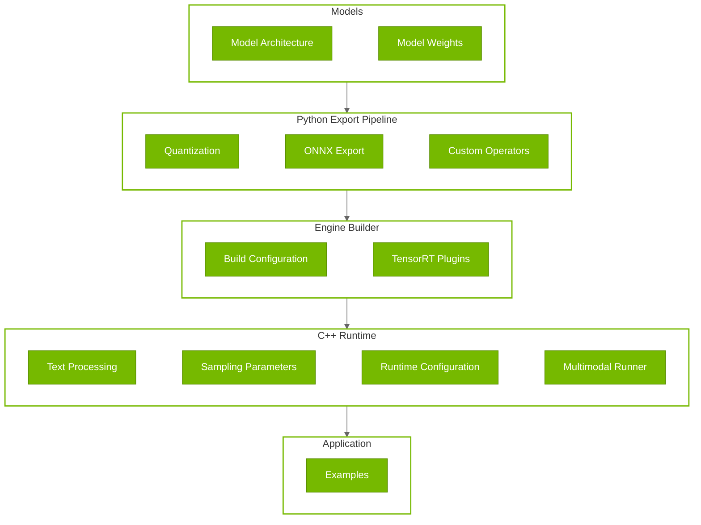

# Customization Guide

## Customization Architecture

TensorRT Edge-LLM follows a clear data flow from models through to inference, with customization points at each layer:



### Customization Points by Layer

| Layer | Component | Customization Options |
|-------|-----------|----------------------|
| **Models** | Model Architecture | **Configuration:** Model config JSON files. **Inherit/Adapt:** `EdgeLLMModel`, `EdgeLLMDecoderLayer` (`nn.Module`) |
| **Models** | Model Weights | **Drop-in:** Load fine-tuned HuggingFace models. **Configuration:** Specify model directory path |
| **Python Export** | Quantization Strategy | **Configuration:** Choose FP16/FP8/INT4_AWQ/NVFP4/INT8_SQ, calibration settings. **Inherit/Adapt:** `modelopt.torch.quantization` classes. **Note:** GPTQ models are loaded as pre-quantized (not created via quantization) |
| **Python Export** | ONNX Export Logic | **Inherit/Adapt:** `export_llm_model()`, `visual_export()`, `export_draft_model()` functions. **Configuration:** Dynamic axes, opset version |
| **Python Export** | Custom Operators | **Registration:** Custom operators via `@torch.library.custom_op()` and `register_custom_op_symbolic()` |
| **Engine Builder** | Build Configuration | **Configuration:** Batch size, sequence length, precision, LoRA rank, EAGLE settings, VLM mode, image tokens. **Inherit/Adapt:** Setup optimization profiles for custom models |
| **Engine Builder** | Custom Operations | **Plugin:** Implement `IPluginV2DynamicExt`, `IPluginCreator` for TensorRT. Examples: Custom attention, specialized kernels |
| **C++ Runtime** | Text Processing | **Configuration:** Load different tokenizer vocab files. **Inherit/Adapt:** `PreTokenizer`, `TokenEncoder` for custom preprocessing |
| **C++ Runtime** | Sampling Parameters | **Configuration:** Temperature, top-k, top-p values in input JSON. **Inherit/Adapt:** Extend `sampling.cu` for custom algorithms |
| **C++ Runtime** | Multimodal Runner | **Inherit/Adapt:** `MultimodalRunner` base class for new multimodal encoders |
| **C++ Runtime** | Runtime Behavior | **Configuration:** EAGLE parameters, warmup iterations, CUDA graphs, system prompt caching, profiling |
| **Application** | Custom Applications | Use examples as templates (see [Examples](05_Examples.md)) |

### Customization Methods Summary

| Method | Description | Best For |
|--------|-------------|----------|
| **Inherit/Adapt** | Extend base classes with custom implementations | Model architectures, Multimodal runner, PreTokenizer |
| **Configuration** | Modify behavior via config files and parameters | Model configs, build settings, runtime parameters, LoRA |
| **Drop-in Replacement** | Substitute entire components with same interface | Fine-tuned model weights |
| **Registration** | Register custom components in existing systems | ONNX custom operators, graph patterns |
| **Plugin** | Implement TensorRT plugins for custom operations | Custom TensorRT layers, hardware-specific ops |

---

## Layer 1: Models

### 1. Model Architecture Customization

The architecture layer provides base classes that wrap HuggingFace models and adapt them for TensorRT Edge-LLM's optimized inference pipeline.

- [`EdgeLLMModel`](../../../tensorrt_edgellm/llm_models/models/llm_model.py): The core model class that wraps a HuggingFace model and replaces its decoder layers with optimized variants.

- [`EdgeLLMDecoderLayer`](../../../tensorrt_edgellm/llm_models/layers/layers.py): Optimized decoder layer that wraps HuggingFace attention and MLP modules.

- [`EdgeLLMAttention`](../../../tensorrt_edgellm/llm_models/layers/layers.py): Multi-headed attention using the custom attention plugin.

TensorRT Edge-LLM automatically detects and supports Llama-style and Qwen-style architectures:
- **Llama-style models**: Use `LlamaAttention` and `LlamaMLP`
- **Qwen-style models**: Use `Qwen2Attention` and `Qwen2MLP`

For other architectures, you may need to extend `EdgeLLMAttention` to wrap your attention mechanism and modify `EdgeLLMDecoderLayer.__init__()` to handle your model type:

```python
if "your_model" in config.model_type:
    attention_module = YourModelAttention(config, index)
    self.mlp = YourModelMLP(config)
    self.self_attn = EdgeLLMAttention(attention_module, ...)
```

### 2. Model Weights Customization

TensorRT Edge-LLM supports **drop-in replacement** of model weights. Any fine-tuned HuggingFace model can be used.

**Compatible Fine-Tuning Methods:**
- Full fine-tuning
- [LoRA (Low-Rank Adaptation)](04.4_Advanced_Runtime_Features.md#lora-low-rank-adaptation-support)
- PEFT adapters (merged)
- GPTQ pre-quantized models

---

## Layer 2: Python Export Pipeline

### 1. Quantization Strategy Customization

#### Quantization Configuration Customization

The quantization system is built on [NVIDIA's Model Optimizer](https://github.com/NVIDIA/Model-Optimizer) and provides multiple quantization strategies.

**Available Methods** (Defined in `tensorrt_edgellm/quantization/llm_quantization.py`):

| Method | Config | Use Case | Platform |
|--------|--------|----------|----------|
| **FP16** | N/A (default) | Baseline accuracy | All |
| **FP8** | `mtq.FP8_DEFAULT_CFG` | Balanced speed/accuracy | SM89+ (Ada Lovelace+) |
| **INT4 AWQ** | `mtq.INT4_AWQ_CFG` | Maximum compression | All |
| **INT8 SmoothQuant** | `mtq.INT8_SMOOTHQUANT_CFG` | Activation quantization | All |
| **NVFP4** | `mtq.NVFP4_DEFAULT_CFG` | NVIDIA 4-bit FP | SM100+ (Blackwell+) |

**Custom Quantization Configuration:**

You can customize quantization behavior by modifying the config dictionary. For details about the config dictionary, refer to [Quantization Formats](https://github.com/NVIDIA/Model-Optimizer/blob/main/modelopt/torch/quantization/config.py).

```python
from tensorrt_edgellm.quantization.llm_quantization import get_llm_quant_config

# Get base config
quant_cfg = get_llm_quant_config("fp8", lm_head_quantization=None)

# Customize: Exclude specific layers from quantization
quant_cfg["quant_cfg"]["*embed_tokens*"] = {"enable": False}
quant_cfg["quant_cfg"]["*lm_head*"] = {"enable": False}

# Customize: Change calibration settings
quant_cfg["algorithm"] = "max"  # Use max calibration instead of entropy
```

#### Calibration Data Customization

The calibration process uses `cnn_dailymail` by default. You can customize with your own calibration dataset:

```python
import torch
from torch.utils.data import DataLoader, Dataset

class CustomCalibDataset(Dataset):
    """Custom calibration dataset for domain-specific quantization."""
    
    def __init__(self, tokenizer, texts, max_length=512):
        self.tokenizer = tokenizer
        self.texts = texts
        self.max_length = max_length
    
    def __len__(self):
        return len(self.texts)
    
    def __getitem__(self, idx):
        encoded = self.tokenizer(
            self.texts[idx],
            max_length=self.max_length,
            padding="max_length",
            truncation=True,
            return_tensors="pt"
        )
        return encoded["input_ids"].squeeze(0)

# Load domain-specific texts (e.g., medical, legal)
domain_texts = load_domain_specific_corpus()

calib_dataset = CustomCalibDataset(tokenizer, domain_texts)
calib_dataloader = DataLoader(calib_dataset, batch_size=16, shuffle=False)

# Use custom calibration data for quantization
quantized_model = quantize_model(model, quant_cfg, calib_dataloader)
```

### 2. ONNX Export Logic Customization

**Main Export Functions** (Defined in `tensorrt_edgellm/onnx_export/llm_export.py`):

- `export_llm_model()`: Export standard LLM or EAGLE base models
- `visual_export()`: Export visual encoder for VLMs
- `export_draft_model()`: Export EAGLE3 draft models

#### LLM Model Export

The [`export_llm_model()`](../../../tensorrt_edgellm/onnx_export/llm_export.py) function handles LLM and EAGLE base model export. To add support for new model architectures, you may need to customize:

- **Inputs**: Modify [`create_dummy_inputs()`](../../../tensorrt_edgellm/onnx_export/llm_export.py) to add model-specific inputs (e.g., `deepstack_visual_embeds` for Qwen3-VL)
- **Dynamic Axes**: Update [`export_model_to_onnx()`](../../../tensorrt_edgellm/onnx_export/llm_export.py) to define dynamic dimensions for new inputs/outputs
- **Input/Output Names**: Ensure ONNX input and output names align with the C++ runtime expectations

#### Multimodal Model Export

The [`visual_export()`](../../../tensorrt_edgellm/onnx_export/visual_export.py) function exports the visual encoder of VLMs to ONNX. Supported models are defined in [visual_models](../../../tensorrt_edgellm/visual_models).

HuggingFace visual models often contain ONNX-incompatible logic (flash attention, shape-dependent initialization, complex post-processing). To add a new multimodal encoder, you may need to extend the original class with a wrapper that:

- **Externalizes shape-dependent computations**: Pass precomputed tensors (e.g., `rotary_pos_emb`, `attention_mask`) as explicit inputs
- **Replaces unsupported operations**: Use standard PyTorch ops instead of flash attention
- **Delegates complex preprocessing/postprocessing to C++ runtime**: Handle operations like dynamic indexing at runtime

See existing [visual_models](../../../tensorrt_edgellm/visual_models) implementations for reference.

### 3. Custom Operators

Custom operators extend PyTorch with operations that map to TensorRT plugins. TensorRT Edge-LLM includes several built-in custom operators:
- **Attention Plugin** (`tensorrt_edgellm/llm_models/layers/attention_plugin.py`)
- **INT4 GEMM Plugin** (`tensorrt_edgellm/llm_models/layers/int4_gemm_plugin.py`)
- **GatherND Plugin** (`tensorrt_edgellm/llm_models/layers/gather_nd.py`)

You can define and register your own custom operators following the existing examples.

```python
@torch.library.custom_op("trt::attention_plugin", mutates_args=())
def attention_plugin(
    qkv: torch.Tensor,
    past_key_value: torch.Tensor,
    context_lengths: torch.Tensor,
    rope_rotary_cos_sin: torch.Tensor,
    num_q_heads: int,
    num_kv_heads: int,
    # ... more parameters ...
) -> Tuple[torch.Tensor, torch.Tensor]:
    """Optimized attention with KV caching and RoPE."""
    pass

# Registration
from tensorrt_edgellm.llm_models.layers.attention_plugin import \
    register_attention_plugin_onnx_symbolic_functions

register_attention_plugin_onnx_symbolic_functions()
```

---

## Layer 3: Engine Builder

### 1. LLM Builder Customization

The [`LLMBuilder`](../../../cpp/builder/builder.h) class builds TensorRT engines from ONNX models. The CLI tool [`llm_build`](../../../examples/llm/llm_build.cpp) provides a command-line interface:

The builder automatically creates **two optimization profiles** for different inference phases:

| Profile | Phase | Input Shape | Purpose |
|---------|-------|-------------|---------|
| 0 | Context (Prefill) | `[batch, 1..maxInputLen]` | Process initial prompts with variable length |
| 1 | Generation (Decode) | `[batch, 1]` | Autoregressive token generation |

To support new model architectures, you need to extend the optimization profile setup methods in [`builder.cpp`](../../../cpp/builder/builder.cpp):

- `setupCommonProfiles()`: Context lengths, RoPE embeddings, KV cache (shared by all models)
- `setupVanillaProfiles()`: Standard LLM input_ids and last_token_ids
- `setupEagleProfiles()`: EAGLE-specific hidden states, attention mask, position IDs
- `setupVLMProfiles()`: Image embeddings for VLMs
- `setupLoraProfiles()`: LoRA weight matrices with dynamic rank

### 2. Multimodal Builder Customization

The [`VisualBuilder`](../../../cpp/builder/builder.h) class builds TensorRT engines for visual encoders. The CLI tool [`visual_build`](../../../examples/multimodal/visual_build.cpp) provides a command-line interface:

To support new visual encoders, you have two options:

1. **Extend VisualBuilder**: Add a new profile setup method (e.g., `setupYourViTProfile()`) in [`builder.cpp`](../../../cpp/builder/builder.cpp). Define optimization profiles with input shapes calculated from `minImageTokens` and `maxImageTokens`.

2. **Use trtexec**: Build the engine directly with TensorRT's command-line tool for simpler models.

---

## Layer 4: C++ Runtime

### 1. Text Processing and Tokenization

The [`Tokenizer`](../../../cpp/tokenizer/tokenizer.h) class provides text encoding/decoding with HuggingFace-compatible loading. It uses a modular architecture:

- **`PreTokenizer`** ([`preTokenizer.h`](../../../cpp/tokenizer/preTokenizer.h)): Regex-based text splitting before encoding
- **`TokenEncoder`** ([`tokenEncoder.h`](../../../cpp/tokenizer/tokenEncoder.h)): BPE encoding algorithm with vocabulary management

The tokenizer automatically loads from the engine directory (uses `tokenizer.json` and `tokenizer_config.json`). To support new tokenization schemes, extend `TokenEncoder` with additional algorithms (e.g., SentencePiece, WordPiece).

### 2. Sampling Parameters

The [`SamplingParams`](../../../cpp/sampler/sampling.h) structure controls token generation randomness. Supported parameters:

| Parameter | Range | Effect |
|-----------|-------|--------|
| `temperature` | 0.0 - 2.0 | **0.0**: Deterministic (greedy). **1.0**: Standard sampling. **>1.0**: More random/creative |
| `top_k` | 0 - vocab_size | **0**: Disabled. **1**: Greedy. **50**: Sample from top 50 tokens |
| `top_p` | 0.0 - 1.0 | **1.0**: Disabled. **0.9**: Nucleus sampling (top 90% prob mass) |

To add more sampling params (e.g., repetition_penalty, logits_bias) or custom sampling algorithms (e.g., beam search), extend the sampling functions in [`sampling.cu`](../../../cpp/sampler/sampling.cu).

### 3. Multimodal Runner

The [`MultimodalRunner`](../../../cpp/multimodal/multimodalRunner.h) base class provides the interface for visual encoder processing in VLMs. The factory method `MultimodalRunner::create()` automatically instantiates the appropriate runner based on model type.

**Existing Runners:**
- [`QwenViTRunner`](../../../cpp/multimodal/qwenViTRunner.h): Qwen2-VL, Qwen2.5-VL, Qwen3-VL
- [`InternViTRunner`](../../../cpp/multimodal/internViTRunner.h): InternVL3
- [`Phi4MMViTRunner`](../../../cpp/multimodal/phi4mmViTRunner.h): Phi-4-multimodal

**To add support for a new VLM**, create a new runner class that inherits from `MultimodalRunner` and implements:

1. `validateAndFillConfig()`: Parse model config and extract dimensions
2. `allocateBuffer()`: Allocate input/output tensors and bind to TensorRT engine
3. `preprocess()`: Handle image loading, preprocessing (resize, normalize), and RoPE computation
4. `infer()`: Execute the visual encoder TensorRT engine

Then register the new runner in `MultimodalRunner::create()` factory method.

### 4. Runtime Features

The [`LLMInferenceRuntime`](../../../cpp/runtime/llmInferenceRuntime.h) provides high-level inference APIs with several optimization features:

- **CUDA Graph Capture**: Reduces kernel launch overhead by capturing and replaying execution sequences via `captureDecodingCUDAGraph()`
- **System Prompt Caching**: Caches KV states for frequently-used system prompts via `genAndSaveSystemPromptKVCache()` to reduce first-token latency
- **LoRA Switching**: Dynamically switches between LoRA adapters at runtime without engine rebuild
- **EAGLE3 Speculative Decoding**: Accelerates generation using draft-then-verify approach via [`llmInferenceSpecDecodeRuntime`](../../../cpp/runtime/llmInferenceSpecDecodeRuntime.h) with tree-based draft proposal and verification

To extend runtime capabilities, modify [`LLMEngineRunner`](../../../cpp/runtime/llmEngineRunner.h) for core execution logic or [`LLMInferenceRuntime`](../../../cpp/runtime/llmInferenceRuntime.cpp) for high-level request handling.

---

## Layer 5: Application

The [`llm_inference`](../../../examples/llm/llm_inference.cpp) example provides a reference implementation for building custom applications.

### Building Custom Applications

Use the example as a template and adapt for your use case:

- **Custom Input/Output Format**: Parse your own request format and convert to `LLMGenerationRequest`
- **Custom Multimedia Input**: The example reads images from files; adapt for your source (video frames, network streams, memory buffers, camera feeds)

```cpp
// my_custom_app.cpp
#include "runtime/llmInferenceRuntime.h"
#include "tokenizer/tokenizer.h"
#include "common/trtUtils.h"

int main(int argc, char** argv) {
    // 1. Parse command line arguments
    // ... argument parsing ...
    
    // 2. Initialize CUDA
    cudaStream_t stream;
    CUDA_CHECK(cudaStreamCreate(&stream));
    
    // 3. Load plugin library
    auto pluginHandles = trt_edgellm::loadEdgellmPluginLib();
    
    // 4. Create runtime
    auto runtime = trt_edgellm::rt::LLMInferenceRuntime::create(
        engineDir,
        multimodalEngineDir,  // Empty string for text-only
        loraWeightsMap,
        stream
    );
    
    // 5. Optional: Warmup and CUDA graph capture
    if (warmupIterations > 0) {
        // Run warmup requests
        runtime->captureDecodingCUDAGraph(stream);
    }
    
    // 6. Process requests
    for (auto const& input : inputs) {
        trt_edgellm::rt::LLMGenerationRequest request;
        trt_edgellm::rt::LLMGenerationResponse response;
        
        // Fill request from input
        request.userPrompt = input.prompt;
        request.systemPrompt = input.systemPrompt;
        request.temperature = input.temperature;
        request.topK = input.topK;
        request.topP = input.topP;
        request.maxGenerateLength = input.maxLength;
        
        // Handle request
        if (!runtime->handleRequest(request, response, stream)) {
            LOG_ERROR("Failed to handle request");
            continue;
        }
        
        // Process response
        std::cout << "Generated: " << response.generatedText << std::endl;
    }
    
    // 7. Cleanup
    CUDA_CHECK(cudaStreamDestroy(stream));
    return 0;
}
```

### Best Practices

**1. Error Handling:**
- Check return values from all API calls
- Use try-catch for exception-prone operations
- Log errors with context for debugging

**2. Resource Management:**
- Create CUDA stream per thread or request
- Properly destroy streams and free GPU memory
- Use RAII patterns for automatic cleanup

**3. Performance Optimization:**
- Warmup before benchmark measurements
- Capture CUDA graphs after warmup
- Cache system prompts when applicable
- Use appropriate batch sizes for your hardware

**4. Testing:**
- Test with various input lengths
- Validate output quality against baseline
- Profile to identify bottlenecks
- Test edge cases (empty inputs, very long sequences)

**5. Deployment:**
- Package required files (engine, tokenizer, plugins)
- Set environment variables (`EDGELLM_PLUGIN_PATH`)
- Document dependencies and system requirements
- Provide example inputs and expected outputs
